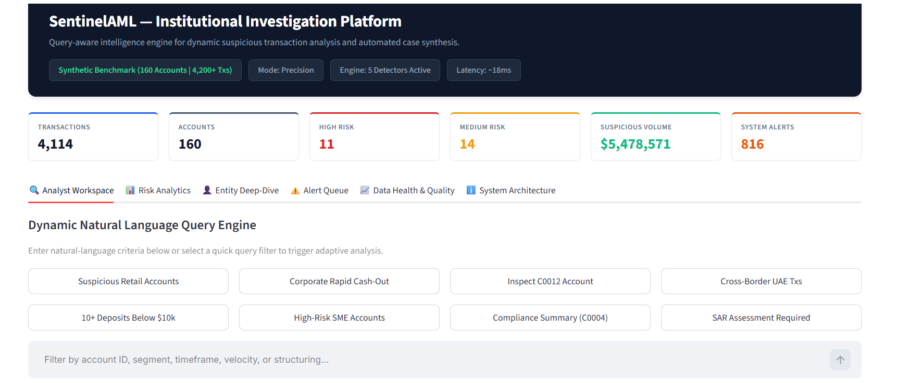
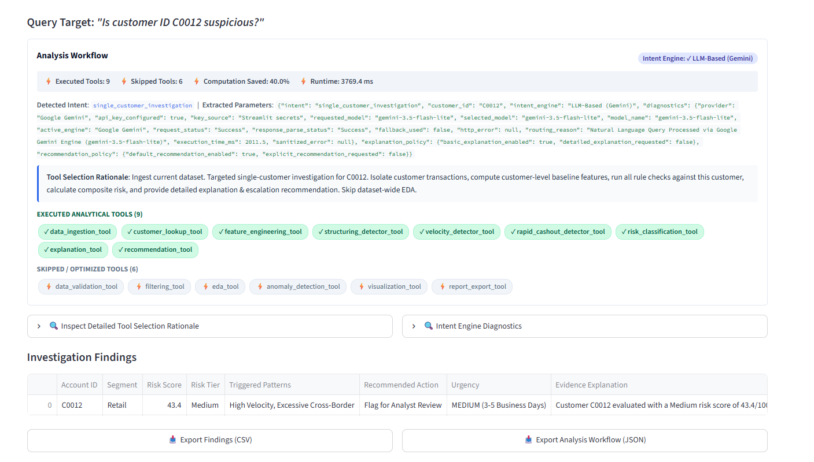
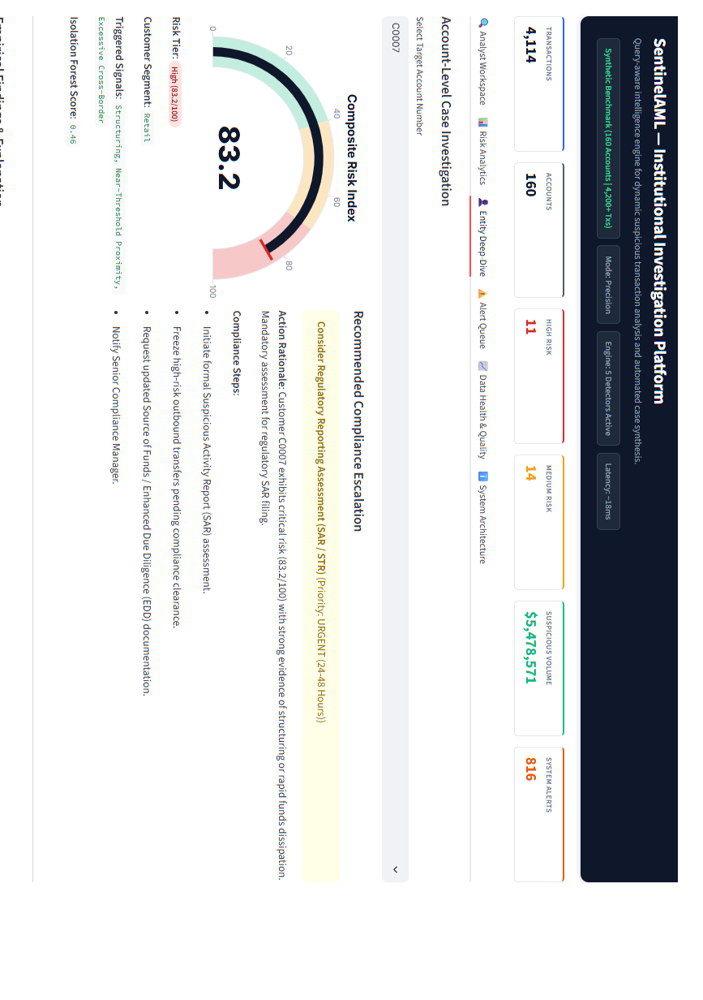
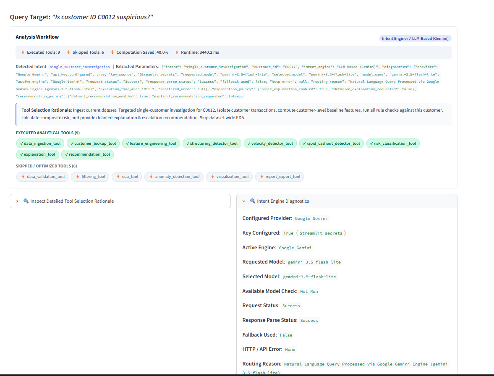

# SentinelAML
### AI-Powered Query-Aware AML Investigation Platform


> **SentinelAML** is an AI-powered AML investigation platform that accepts natural-language analyst queries and dynamically plans which analytical tools to execute, rather than running a fixed detection pipeline on every request. By skipping unnecessary tools per query, it achieves roughly **45–66% computation savings** depending on the investigation type.

<!-- Add a dashboard screenshot here, e.g.: -->
<!--  -->

---

## Problem Statement

Financial institutions are required to run Anti-Money Laundering (AML) compliance programs, but traditional rule-based systems apply the same fixed detection pipeline to every query — regardless of what the analyst is actually asking. This generates excessive false positives, wastes compute on unnecessary checks, and overwhelms compliance teams who end up manually tuning rules instead of investigating real threats.

SentinelAML addresses this by building an agent that reads a natural-language query, works out what's actually being asked (a broad pattern search, a single-customer lookup, a segment-level investigation, etc.), and only invokes the analytical tools relevant to that specific request — skipping the rest and explaining why. It then produces a risk score, a human-readable explanation, and a recommended escalation action for every flagged customer or transaction.

---

## Key Platform Capabilities

1. **Query-Aware Dynamic Planning**
   - No rigid static pipeline. For every query, SentinelAML builds an adaptive tool chain and skips redundant detectors.
   - Reports real-time **Planner Optimization Metrics** — tools executed, tools skipped, % computation saved, and runtime.

2. **First-Class EDA Tool Orchestration**
   - Exploratory Data Analysis (`eda_tool`) is a planner-invokable tool, not a fixed dashboard tab.
   - Executed for broad/segment queries, skipped for single-account investigations — with a visible audit rationale for the decision either way.

3. **Hybrid Intent Engine with Automatic Fallback**
   - Primary path: LLM-based natural-language intent extraction via Google Gemini (`gemini-3.5-flash-lite`).
   - Automatic fallback to a deterministic rule-based intent parser if the API key is unavailable, the LLM request fails, or the response cannot be parsed, ensuring the application remains functional.
   - The UI explicitly shows which engine handled each query (`✓ LLM-Based (Gemini)` or `✓ Rule-Based Fallback`) via an Intent Engine Diagnostics panel.

4. **Customer Segmentation Support**
   - Dataset includes customer segments: `Retail`, `SME`, `Corporate`, `Business`, `High Net Worth`, `Government`, `NGO`.
   - Queries can filter by segment (e.g. *"Show suspicious retail accounts"*, *"Analyse corporate accounts with rapid cash-out"*).

5. **Explainable Rule Detectors & ML Anomaly Model**
   - Deterministic rule detectors: Structuring, Near-Threshold, High Velocity, Rapid Cash-Out, Cross-Border, Unusual Amount.
   - Unsupervised Isolation Forest model for statistical outlier scoring, combined with rule output into a hybrid risk signal.

6. **Composite Risk Index & Evidence Synthesis**
   - 0–100 composite risk score mapped to Low / Medium / High tiers.
   - Evidence summaries cite exact triggered patterns, transaction counts, and deviation from customer baseline behaviour.
   - Ground-truth benchmark evaluation (Precision / Recall / F1 / Accuracy) against injected synthetic labels, for demonstration purposes only.

7. **Audit-Ready Reporting**
   - Exportable execution plan (JSON) detailing tool selection/skip rationale per query.
   - Exportable findings and flagged-alert queue (CSV).

---

## Tech Stack

| Layer | Technology |
|---|---|
| Frontend / UI | Streamlit |
| Backend | Python |
| Data processing | Pandas, NumPy |
| Visualization | Plotly |
| Machine learning | Scikit-learn (Isolation Forest) |
| AI intent extraction | Google Gemini API (`gemini-3.5-flash-lite`) |
| Testing | PyTest |
| Data formats | CSV, JSON |

---

## Repository Structure

```text
SentinelAML/
├── app.py                      # Main Streamlit application
├── README.md
├── AGENTS.md                   # Agentic architecture breakdown
├── requirements.txt
├── src/
│   ├── agent.py                 # Orchestrator agent
│   ├── planner.py                # Query-aware dynamic execution planner & metrics
│   ├── intent_parser.py          # Hybrid AI + deterministic intent parser
│   ├── rules.py                  # Rule-based AML detectors
│   ├── risk.py                   # Composite 0-100 risk scoring engine
│   ├── anomaly.py                 # Isolation Forest anomaly detector
│   ├── features.py                # Feature engineering & aggregations
│   ├── data_generator.py           # Synthetic banking data generator
│   ├── data_loader.py              # CSV ingestion & schema normalizer
│   ├── validation.py                # Data quality & schema validator
│   ├── visualizations.py            # Plotly chart definitions
│   ├── explanations.py               # Natural language evidence synthesizer
│   ├── recommendations.py            # Escalation action engine
│   ├── evaluation.py                  # Benchmark metrics calculator
│   └── reports.py                      # CSV / JSON report exporters
├── tests/
│   ├── test_intent_parser.py
│   ├── test_planner.py
│   ├── test_risk.py
│   ├── test_rules.py
│   └── test_ui_rendering.py
└── docs/
    ├── architecture.md
    ├── system_design.md
    ├── case_study.md
    └── demo_script.md
```

---

## Dataset Information

SentinelAML works with two data sources — no real banking or customer data is used anywhere in this project.

**1. Synthetic Benchmark Dataset (default)**
Generated on demand from a configurable random seed. Includes a configurable number of customer accounts and transactions across multiple segments, countries, and channels, with deliberately injected suspicious patterns (structuring, rapid cash-out, high velocity, cross-border, near-threshold, unusual amounts) and corresponding ground-truth labels used only for benchmark evaluation.

### Dataset Source

The default dataset used in SentinelAML is a synthetically generated banking transaction dataset created specifically for this hackathon. No real customer or banking data is used.

The data generator simulates realistic banking behaviour while injecting known AML patterns such as:
- Structuring
- Rapid Cash-Out
- High Transaction Velocity
- Cross-Border Transactions
- Near-Threshold Transactions
- Unusual Amounts

This enables benchmarking and demonstration without exposing sensitive financial information.

**2. Custom CSV Upload**
Analysts can upload their own transaction CSV. Required and optional columns:

**Minimum required columns:**
```text
transaction_id
customer_id
transaction_date
amount
transaction_type
country
customer_segment
```

**Column descriptions:**

| Column | Description |
|---|---|
| `transaction_id` | Unique transaction identifier |
| `customer_id` | Unique customer identifier |
| `transaction_date` | Date of the transaction |
| `amount` | Transaction amount |
| `transaction_type` | Deposit / Withdrawal / Transfer / etc. |
| `country` | Country where the transaction occurred |
| `customer_segment` | Retail / SME / Corporate / Business / High Net Worth / Government / NGO |

**Optional additional columns** (used if present): `currency`, `account_type`, `channel`, `merchant`, `risk_flag` (if pre-labelled), `balance`.

---

## Setup & Installation

```bash
# 1. Clone the repository
git clone <your-repo-url>
cd SentinelAML

# 2. Install dependencies
pip install -r requirements.txt

# 3. (Optional) Configure the Gemini API key for AI-based intent extraction
# Create .streamlit/secrets.toml in the project root:
```

```toml
# .streamlit/secrets.toml
GEMINI_API_KEY = "your_gemini_api_key_here"
```

> If no key is configured, the application automatically falls back to a deterministic rule-based intent parser — it will still run fully, just without LLM-based query understanding.

```bash
# 4. Run the automated test suite (optional)
pytest tests

# 5. Launch the application
streamlit run app.py
```

---

## Usage

1. Launch the app and either use the default synthetic benchmark dataset or upload your own CSV (see schema above).
2. Type a natural-language investigation query into the query box, or click one of the quick-filter suggestions. Examples:
   - `Analyse suspicious retail customers`
   - `Corporate accounts with rapid cash-out`
   - `Is customer ID C0012 suspicious?`
   - `Which customers made 10+ transactions under $10,000?`
3. Review the **Analysis Workflow** panel: detected intent, extracted parameters, tools executed vs. skipped, and the reasoning behind each decision.
4. Open **Intent Engine Diagnostics** to see which engine (LLM or rule-based fallback) handled the query.
5. Review **Investigation Findings** — risk score, risk tier, triggered patterns, recommended escalation action, and evidence explanation for each flagged account.
6. Use the **Risk Analytics**, **Entity Deep-Dive**, **Alert Queue**, and **Data Health & Quality** tabs for portfolio-level analysis, single-account case investigation, flagged-transaction review, and dataset diagnostics respectively.
7. Export findings (CSV) or the full execution plan (JSON) for audit purposes.

---

## Screenshots

| Dashboard | Planner Output |
|---|---|
|  |  |

| Investigation Findings | Intent Engine Diagnostics |
|---|---|
|  |  |

---

## Why SentinelAML?

Unlike traditional AML systems that execute the same fixed pipeline for every request, SentinelAML dynamically plans each investigation based on the analyst's query — reducing unnecessary computation while maintaining explainable, auditable decision-making through a hybrid combination of LLM-based reasoning, deterministic AML rules, and machine learning.

---

## Documentation Links

- [System Design](docs/system_design.md)
- [End-to-End Case Study](docs/case_study.md)
- [Agent Architecture Breakdown](AGENTS.md)
- [Demo Script](docs/demo_script.md)
